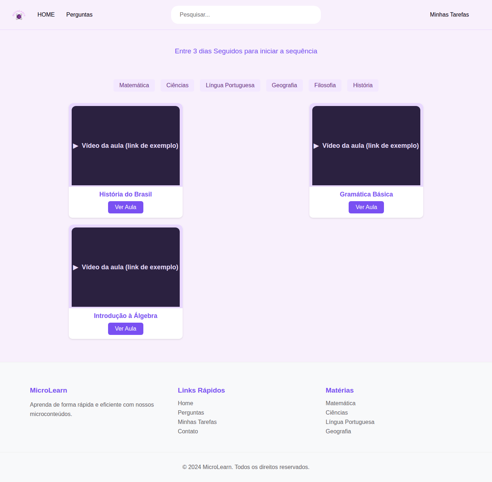
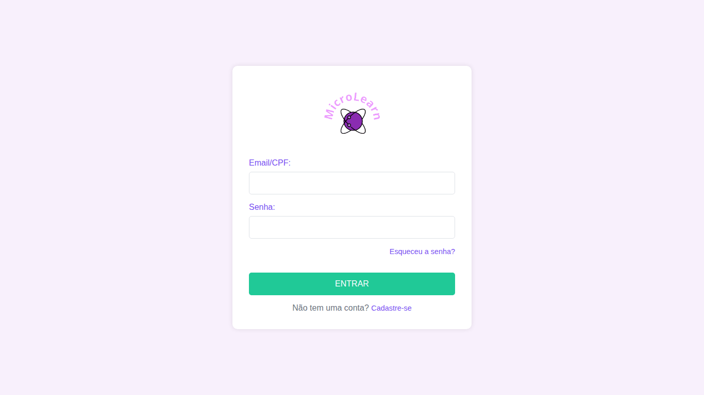
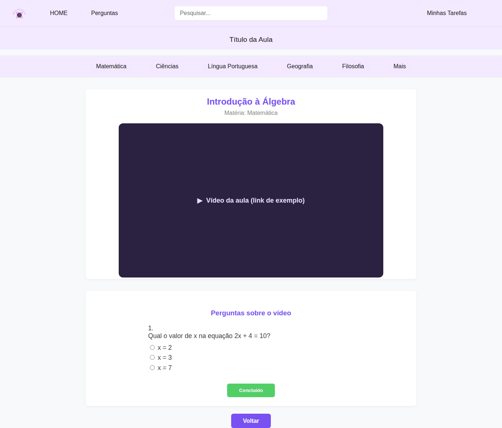
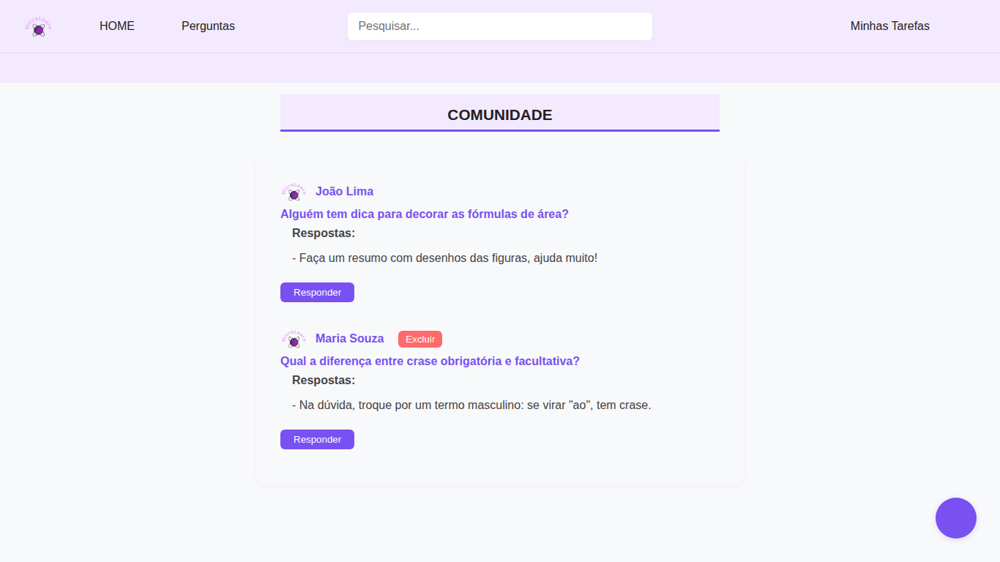
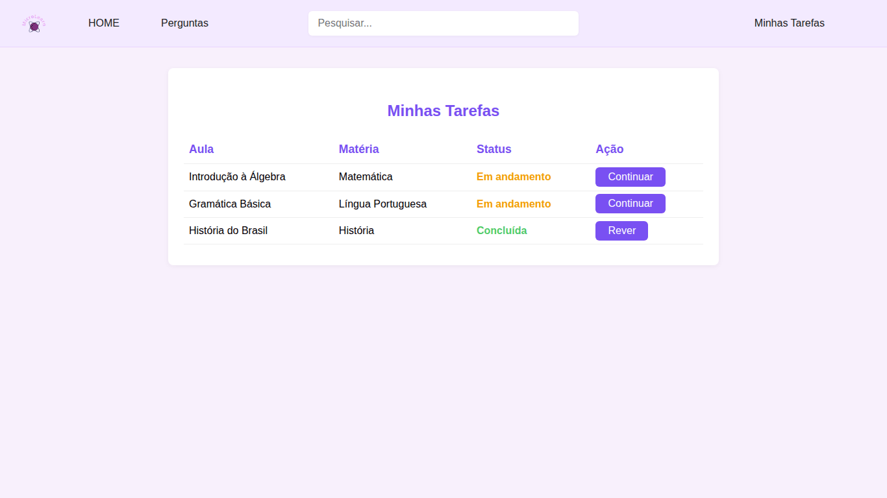
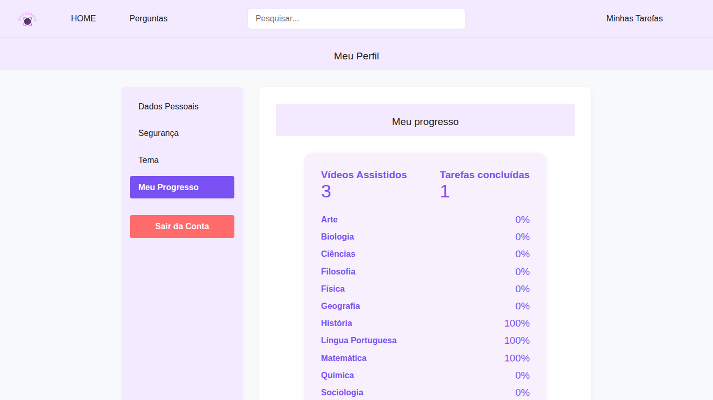
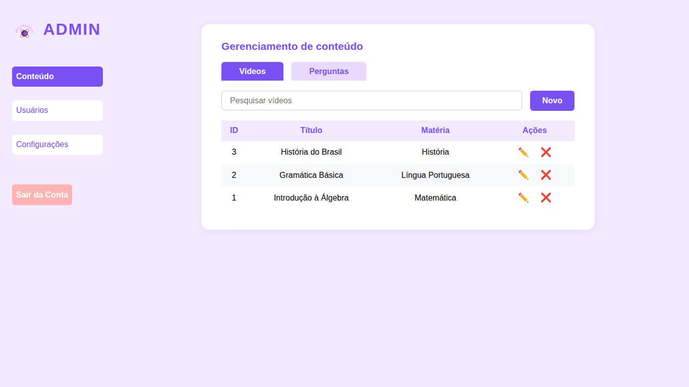

# MicroLearn — Plataforma de Microaprendizado

Aplicação web de microaprendizado em que o aluno assiste a vídeo-aulas curtas, responde a um quiz para concluir cada aula, acompanha o próprio progresso e tira dúvidas com a comunidade. Tem ainda um painel administrativo separado para visualizar o conteúdo cadastrado.

Projeto full stack com renderização no servidor (**Node.js + Express + EJS**) e banco **MySQL**.



## Funcionalidades

**Conta e autenticação**
- Cadastro e login por **e-mail ou CPF**, com senha armazenada como hash **bcrypt**
- Sessão com **Passport (estratégia local)** + `express-session`
- Recuperação de senha por e-mail (Nodemailer), com token aleatório válido por 1 hora e de uso único

**Aprendizado**
- Dashboard com as aulas cadastradas e filtro por matéria (Matemática, Ciências, Língua Portuguesa, Geografia, Filosofia, História)
- Contador de **sequência de dias de acesso** no dashboard
- Página da vídeo-aula com **quiz** de múltipla escolha da matéria; ao acertar todas as perguntas, a aula é marcada como concluída
- **Minhas Tarefas**: aulas abertas pelo aluno, com status *em andamento* ou *concluída*
- **Meu Progresso** (no perfil): vídeos assistidos, tarefas concluídas e percentual por matéria

**Comunidade**
- Fórum de dúvidas com perguntas e respostas; o autor pode excluir a própria pergunta

**Perfil**
- Edição de nome, e-mail e telefone, upload de foto (JPG/PNG/WEBP/GIF até 2 MB) e preferência de tema

**Painel administrativo** (servidor separado, porta 4000)
- Login com credenciais definidas por variável de ambiente
- Listagem das aulas cadastradas com a respectiva matéria

## Telas

| Login | Vídeo-aula com quiz |
|---|---|
|  |  |

| Comunidade | Minhas Tarefas |
|---|---|
|  |  |

| Meu Progresso | Painel admin |
|---|---|
|  |  |

> Os vídeos do banco de exemplo usam links fictícios (`youtube.com/embed/example1`...). Nos prints, o player foi substituído por um quadro indicando isso.

## Tecnologias

| Camada | Ferramentas |
|---|---|
| Back-end | Node.js, Express 4 |
| Views | EJS (renderização no servidor), CSS e JavaScript puro no front |
| Banco | MySQL 8 / MariaDB, driver `mysql2` (pool de conexões) |
| Autenticação | Passport + passport-local, express-session, bcrypt |
| Outros | Multer (upload), Nodemailer (e-mail), dotenv (configuração) |

## Como rodar localmente

### Pré-requisitos
- [Node.js](https://nodejs.org/) 18 ou superior
- MySQL 8+ ou MariaDB 10.5+ (por exemplo, o do XAMPP)

### 1. Clonar e instalar as dependências
```bash
git clone https://github.com/iagokoch/plataforma-de-microaprendizado.git
cd plataforma-de-microaprendizado
npm install
```

### 2. Configurar as variáveis de ambiente
Copie o modelo e preencha os valores:
```bash
cp .env.example .env        # no Windows (PowerShell): copy .env.example .env
```

| Variável | Descrição |
|---|---|
| `PORT`, `APP_URL` | Porta da aplicação (padrão 3001) e URL usada no link do e-mail de recuperação |
| `SESSION_SECRET` | Segredo da sessão dos alunos (string longa e aleatória) |
| `DB_HOST`, `DB_PORT`, `DB_USER`, `DB_PASSWORD`, `DB_NAME` | Conexão com o MySQL |
| `ADMIN_PORT`, `ADMIN_USER` | Porta (padrão 4000) e usuário do painel admin |
| `ADMIN_PASSWORD_HASH` | Hash bcrypt da senha do admin (veja abaixo) |
| `ADMIN_SESSION_SECRET` | Segredo da sessão do painel admin |
| `EMAIL_*` | SMTP para a recuperação de senha (opcional para testar o resto) |

Para gerar os segredos de sessão:
```bash
node -e "console.log(require('crypto').randomBytes(32).toString('hex'))"
```

### 3. Criar o usuário administrador
A senha do admin **não fica no código nem em texto puro**: o `.env` guarda apenas o hash bcrypt.
```bash
npm run hash-password -- "escolha-uma-senha-forte"
```
Copie o hash gerado para o `.env`, entre aspas simples (ele contém `$`):
```env
ADMIN_USER=seu-usuario
ADMIN_PASSWORD_HASH='$2b$10$...'
```

### 4. Criar o banco de dados
O script `database/microlearn.sql` cria o banco `microlearn`, as tabelas e dados de exemplo (matérias, 3 aulas e perguntas de quiz).

> ⚠️ O script **apaga e recria** o banco `microlearn` se ele já existir.

Escolha uma das opções:
```bash
# a) pelo script do projeto (usa as credenciais DB_* do .env)
npm run db:setup

# b) pelo cliente MySQL
mysql -u root -p < database/microlearn.sql
```
Ou importe o arquivo pelo phpMyAdmin (aba **Importar**).

### 5. Iniciar
```bash
npm start          # aplicação:  http://localhost:3001
npm run admin      # painel admin: http://localhost:4000
```
Crie uma conta em `/cadastro` para usar a plataforma.

## Estrutura do projeto

```
plataforma-de-microaprendizado/
├── server.js               # App principal: Express, sessão, Passport e rotas
├── adminServer.js          # Painel administrativo (servidor separado)
├── setup-database.js       # Executa database/microlearn.sql (npm run db:setup)
├── config/
│   ├── db-config.js        # Credenciais do banco lidas do .env (fonte única)
│   └── database.js         # Pool mysql2 com API de Promises
├── database/
│   ├── connection.js       # Pool mysql2 com API de callbacks
│   └── microlearn.sql      # Schema + dados de exemplo
├── routes/
│   ├── index.js            # Páginas (dashboard, aula, perfil, tarefas...)
│   ├── users.js            # Cadastro, login, perfil, progresso, recuperação de senha
│   └── api/                # APIs de perguntas, matérias e aulas
├── views/                  # Templates EJS (views/admin/ = painel admin)
├── public/                 # CSS, JS do front, imagens e uploads
├── scripts/
│   └── hash-password.js    # Gera o hash bcrypt da senha do admin
└── docs/screenshots/       # Imagens deste README
```

## Rotas principais da API

| Método | Rota | Descrição | Login |
|---|---|---|---|
| POST | `/api/users/register` | Cadastro de aluno | — |
| POST | `/api/users/login` | Login (e-mail ou CPF) | — |
| POST | `/api/users/forgot-password-request` | Envia e-mail de recuperação | — |
| POST | `/api/users/reset-password` | Redefine a senha com o token | — |
| GET | `/api/users/progresso` | Progresso do aluno | ✔ |
| GET | `/api/users/acessos/semana` | Acessos dos últimos 7 dias (sequência) | ✔ |
| POST | `/api/users/atualizar-perfil` | Atualiza dados e foto | ✔ |
| POST | `/api/users/theme` | Salva o tema preferido | ✔ |
| GET | `/api/perguntas` | Lista as dúvidas da comunidade | — |
| POST | `/api/perguntas` | Cria uma dúvida | ✔ |
| POST | `/api/perguntas/:id/respostas` | Responde uma dúvida | ✔ |
| DELETE | `/api/perguntas/:id` | Exclui a própria dúvida | ✔ |
| GET | `/api/materias` | Lista as matérias | — |
| POST | `/aula/:id/concluir` | Marca a aula como concluída | ✔ |

## Segurança

Pontos tratados no projeto:
- Senhas de usuários e do admin com **hash bcrypt**; nenhuma credencial no código ou no repositório (`.env` ignorado pelo git, com `.env.example` como modelo)
- Ações do fórum usam o usuário da **sessão** (`req.user.id`), nunca um id enviado pelo navegador, o que evita que alguém poste ou exclua em nome de outro usuário (IDOR)
- Conteúdo digitado por usuários é **escapado** antes de ir para a página (proteção contra XSS armazenado)
- Upload de foto restrito a **imagens de até 2 MB**, com a extensão definida pelo tipo validado
- Mensagem de erro de login única para usuário inexistente e senha errada (evita enumeração de contas)
- Queries parametrizadas (`?`) em todo o acesso ao banco (proteção contra SQL injection)

## Limitações conhecidas e próximos passos

- **Painel admin**: por enquanto só lista as aulas; os botões *Novo*, *Editar*, *Excluir*, *Usuários* e *Configurações* ainda não têm back-end.
- **Quiz**: a correção é feita no navegador (as alternativas corretas chegam ao cliente); o ideal é validar as respostas no servidor.
- **Telas sem back-end**: a barra de pesquisa e a página *Perfil → Segurança* são apenas visuais.
- **Vídeos de exemplo**: os links do `microlearn.sql` são fictícios; troque `video_url` por links de incorporação reais (`https://www.youtube.com/embed/ID`).
- **`GET /api/aulas/:id`**: usa as tabelas `aulas_perguntas` e `aulas_opcoes_resposta`, que não fazem parte do schema; o endpoint não é usado pelas telas.
- **Produção**: faltam proteção CSRF, limite de tentativas de login (rate limiting), store de sessão persistente (hoje é a MemoryStore padrão) e testes automatizados.
- Arquivos legados não utilizados pela aplicação: `app.js`, `models/Usuario.js`, `js/validacao.js` e `public/js/`.

## Autor

**Iago Koch** — [LinkedIn](https://www.linkedin.com/in/iago-koch) · [GitHub](https://github.com/iagokoch)
